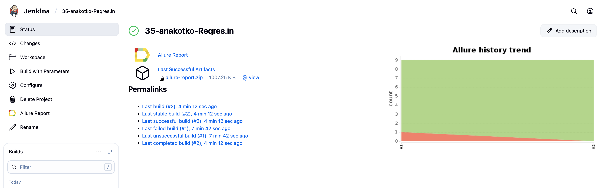
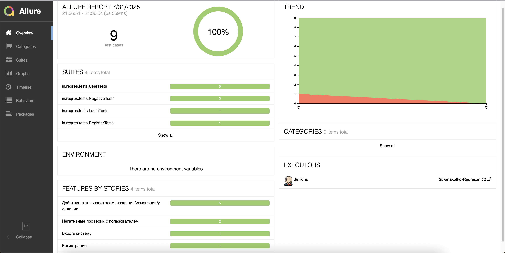
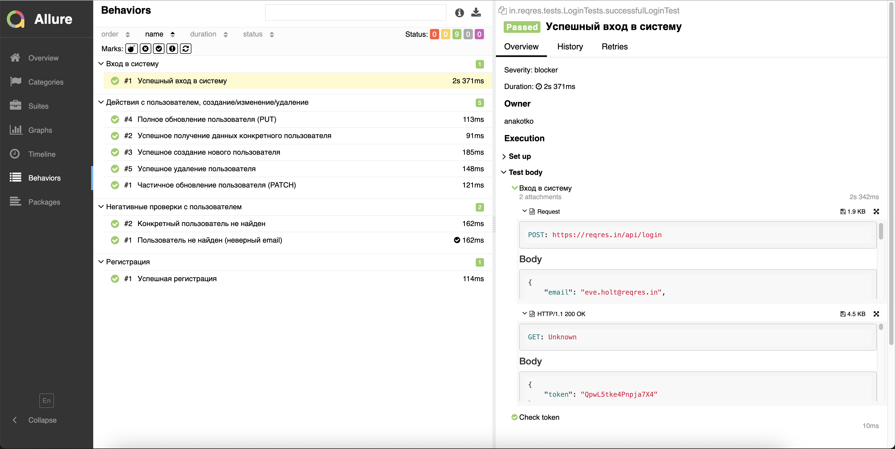
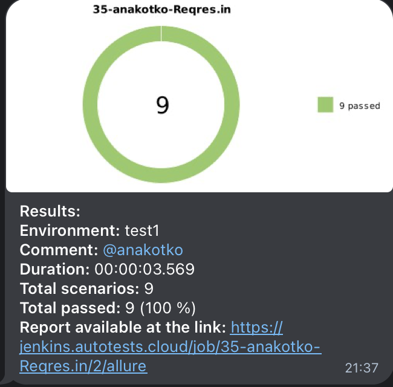

<p align="center">
  <a href="https://reqres.in/" target="_blank">
    
  </a>
</p>

# Проект по автоматизации тестовых сценариев для API сервиса [Reqres.in](https://reqres.in/)

## Содержание
- [Технологический стек](#-технологический-стек)
- [API-тесты](#-api-тесты)
- [Запуск тестов в Jenkins](#-запуск-тестов-в-jenkins)
- [Allure-отчет](#-allure-отчет)
- [Уведомления в Telegram](#-уведомления-в-telegram)

## 💻 Технологический стек

<div align="center">
  <table>
    <tr>
      <!-- Первая строка -->
      <td align="center" width="110">
        <a href="https://www.jetbrains.com/idea/" target="_blank">
          
        </a>
        <br>IDEA
      </td>
      <td align="center" width="110">
        <a href="https://www.java.com" target="_blank">
          
        </a>
        <br>Java
      </td>
      <td align="center" width="110">
        <a href="https://junit.org/junit5/" target="_blank">
          
        </a>
        <br>JUnit 5
      </td>
      <td align="center" width="110">
        <a href="https://gradle.org/" target="_blank">
          
        </a>
        <br>Gradle
      </td>
      <td align="center" width="110">
        <a href="https://rest-assured.io/" target="_blank">
          
        </a>
        <br>Rest-Assured
      </td>
    </tr>
    <tr>
      <!-- Вторая строка -->
      <td align="center" width="110">
        <a href="https://telegram.org/" target="_blank">
          
        </a>
        <br>Telegram
      </td>
      <td align="center" width="110">
        <a href="https://docs.qameta.io/allure/" target="_blank">
          
        </a>
        <br>Allure
      </td>
      <td align="center" width="110">
        <a href="https://www.jenkins.io/" target="_blank">
          
        </a>
        <br>Jenkins
      </td>
      <td align="center" width="110">
        <a href="https://github.com/" target="_blank">
          
        </a>
        <br>GitHub
      </td>
    </tr>
  </table>
</div>

Автотесты для данного проекта написаны на <code>Java</code> с использованием библиотеки <code>REST-assured</code> для взаимодействия с REST api.

В качестве фреймворка для запуска тестов используется <code>Junit5</code>, а в качестве сборщика проекта - <code>Gradle</code>. Произведена настройка CI в <code>Jenkins</code>.

По результатам каждого тестового прогона создаётся <code>Allure</code> отчёт для визуализации результатов прогона.

После прогона тестов <code>Telegram</code> бот присылает сообщение с информацией о прошедшем прогоне

---

## 🌐 API-тесты

### Основные проверки
- ✅ Вход в систему
- ✅ Регистрация
- ✅ Действия с пользователем, создание/изменение/удаление
- ✅ Негативные проверки с пользователем

---

## [ Запуск тестов в Jenkins](https://jenkins.autotests.cloud/job/35-anakotko-Reqres.in/)

### Локальный запуск
```bash
gradle clean test
```


### Удаленный запуск (Jenkins)
Для запуска тестов в Jenkins нужно нажать на кнопку Build With Parameters в соответствующей сборке

<p align="center">

</p>


## [ Allure-отчет](https://jenkins.autotests.cloud/job/35-anakotko-Reqres.in/2/allure/)

### Главная страница Allure-отчета


### Пример отчета о выполнении тестов
Содержит в себе:
- Шаги теста
- Request
- Response
  


##  Уведомления в Telegram

### После завершения сборки, бот, созданный в Telegram, автоматически обрабатывает и отправляет сообщение с результатом

<p align="center">

</p>